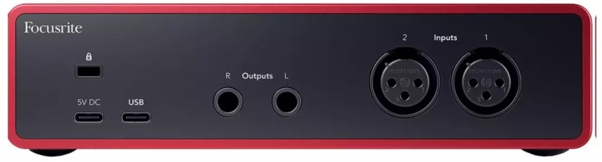

import { Aside, Tabs, TabItem, Card } from "@astrojs/starlight/components";
 
This section will go over all the **audio components.** You'll learn what they do, how to connect them and how to troubleshoot them.

<Aside type="tip" title="Don't be afraid!">
  Audio components may look confusing or complicated but they're easy to
  understand. Keep an open mind and it will make sense at the end.
</Aside>

## Microphone

The microphone you'll be using is the Shure MX 393/O. This captures audio around it and it's great for a meeting room. This should be placed on high flat surface like a desk.

### Shure MX 393/O

As you can see this microphone has two parts, the microphone itself and an XLR adapter that we will talk about latter on.

<Aside type="caution">
  The cable is permanently attach to the microphone and it's fragile. Handle
  with care and don't put unnecessary stress at the ends.
</Aside>

### Functionality

This microphone has an **omnidirectional polar pattern,** meaning it can capture audio around them, the audio decreases in quality the further you are from them.

Here's an illustration on different polar pattern used for microphones

As you can see the **Omni-directional** pattern covers an area **around** the microphone.

<Aside>
  Remember that the microphones is crucial for a good capture of the room's
  audio. You only have **12 ft** of cable.
</Aside>

### Position

A great position for this microphone is a **table.** Position the microphones were the most **conversational interaction** happens making sure the two microphones are **at least 6ft apart** for optimal audio capture.

<Aside type="danger">
  Make sure to position the microphones were the least **physical interaction**
  is going to happen. These are sensitive microphones and noises like **closing
  a paper tray or unboxings will be loud** if it happens near them.
</Aside>

## Audio Interface

The interface you will be using is the Focusrite Scarlett 2i2 (4th gen). This component will transform the analog signature of the microphones into a digital input for the computer.

### Focusrite Scarlett 2i2 Gen 4 Audio Interface

This component looks complex but after knowing what all the parts mean, it will be self-explanatory.

### Functionality

We will split the functionality into two parts

- Front of the Interface
- Back of the Interface

### Front of the Interface

The front of this audio interface has the most population of buttons and knobs, but we'll walk through what they mean and how they work.

Let's focus in the left side first.

### Knobs

You'll see two knobs on the left with an RGB (Red Green Blue) light ring around them. These control the gain of the microphones.

<Card title="Turning the knobs">
  <Tabs>
    <TabItem label="Clockwise">
      This will **increase the gain** of the microphones. The microphones will
      become more sensitive to sound.
      <Aside>
        If you want to record subjects that are far away from the microphones,
        you should increase the gain.
      </Aside>
      <Aside type="danger" title="Keep in mind">
        The more sensitive the microphones are, the more background noise it
        will pick up. Noise that happens near the microphones will be louder.
      </Aside>
    </TabItem>
    <TabItem label="Counterclockwise">
      This will **decrease the gain** of the microphone. The microphones will
      become less sensitive to sound.
      <Aside>
        If you have a lot of background noise, try reducing the gain on the
        microphone.
      </Aside>
      <Aside type="caution" title="Keep in Mind">
        The lower the gain, the less backgorund noise, but the closer you
        subjects need to be to the microphones.
      </Aside>
    </TabItem>
  </Tabs>
</Card>

The RGB ring will change colors from green white to red. These colors have meaning and need to be managed constantly if your

<Card title="RGB Ring Color">
  <Tabs>
    <TabItem label="White or Off">
      Little to no audio is being picked up. Increase the microphone gain to fix
      this.
      <Aside title="Get Help">
        Make sure you have someone that can help you test the microphones by
        speaking where subjects are going to stand or interact.
      </Aside>
      <Aside type="caution" title="Keep in Mind">
        You might be hearing some audio, but this will have a low volume in
        playback. Make sure you are recording withing the green light.
      </Aside>
    </TabItem>
    <TabItem label="Green">
      The is the color you want to be recording, this will ensure your recording
      is at the **best quality and volume.**
      <Aside>
        It's normal for the light to blink and not always solid, this is because
        its showing the highest pitch in the color, not when it's recording.
      </Aside>
    </TabItem>
    <TabItem label="Yellow">
      The audio is getting to **close to be distorted.** Lower the gain just a
      bit to get back to the green light.
      <Aside>
        Random Yellow's can happen, but they are normal. This happens when
        people laugh, cough or speak with excitement.
      </Aside>
    </TabItem>
    <TabItem label="Red">
      <Aside type="danger">
        The Audio is clipping. These means that audio is distorted and too loud.
        **You should dial back the gain** until you see green.
      </Aside>
    </TabItem>
  </Tabs>
</Card>

### Buttons

Their are 6 buttons on the left side, the important ones is **48V** and **Safe**. These should be on at all times.

<Aside>
  You don't need to toggle Safe or Auto, these don't work as well as you might
  think
</Aside>

Here's a table of what all the buttons do.

| Button | Description                                                                                                                                            |
| ------ | ------------------------------------------------------------------------------------------------------------------------------------------------------ |
| Select | Move the selection to the next preamp. The other buttons change to control the input you select. The currently selected channel's number lights green. |
| 48V    | 48V phantom power at the XLR mic input to power condenser microphones. When 48V is on, the Scarlett 2i2 applies 48V phantom power to both inputs.      |
| Inst   | Toggle the selected 6.35mm (1/4") input between Line or Instrument level.                                                                              |
| Auto   | Start the Auto Gain feature                                                                                                                            |
| Safe   | Turn on the Clip Safe feature for your input                                                                                                           |
| Air    | Turn on AIR mode                                                                                                                                       |

### Right Side of the Interface

You are not goin to use this part. This is for monitoring the audio, but you will be using OBS monitoring since you're going to clean the audio a bit before it goes to recording or Zoom.

### Back side of the Interface

There's only three things you need to get familiar with:

- Input 1
- Input 2
- USB

| Input   | Function                                                                                          |
| ------- | ------------------------------------------------------------------------------------------------- |
| Input 1 | XLR input 1                                                                                       |
| Input 2 | XLR Input 2                                                                                       |
| USB     | USB type C port that will transfer audio to the computer and deliver power to the audio interface |

Now let's talk about Video.
