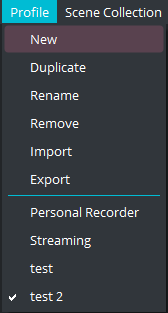
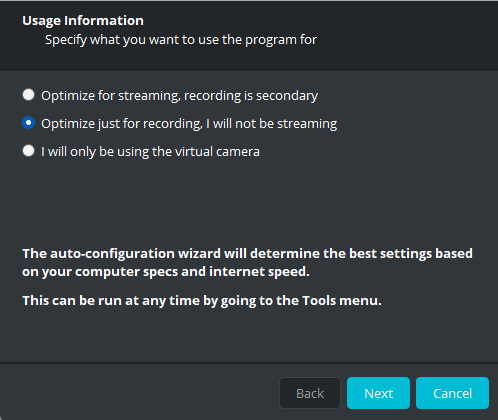
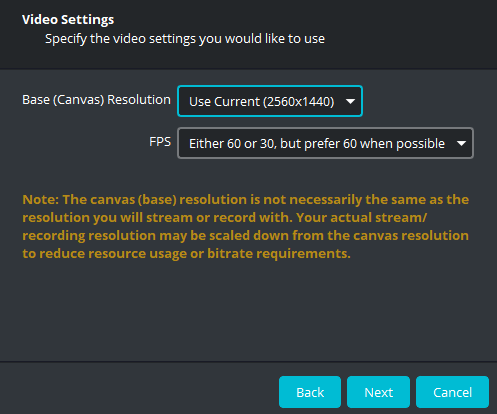
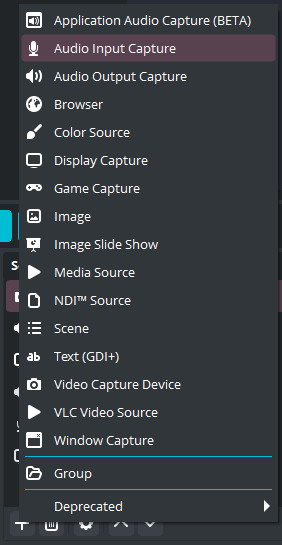

import {
  Aside,
  Tabs,
  TabItem,
  Card,
  Steps,
  LinkCard,
} from "@astrojs/starlight/components";

OBS is a free to use opensource software that you'll use to record audio and video.

## Functions

OBS can be used for lot's of things and therefore there's a broad selection of inputs and outputs but we are only goin to go over the one's we'll use.

<LinkCard
  href="#environment-setup"
  title="Environment Setup"
  description="Setup your OBS environment for recording"
/>
<LinkCard
  href="#scenes"
  title="Scenes"
  description="Learn what is an OBS scene and its usage"
/>
<LinkCard
  href="#sources"
  title="Sources"
  description="Guide on what a source is and how to add them"
/>
<LinkCard
  href="#broadcasting-and-recording"
  title="Broadcasting and Recording"
  description="Learn how to record and share video and audio in zoom"
/>

## Environment setup

The first time you open OBS you'll maybe see a profile already loaded with scenes and sources. If you want with a fresh profile and scene collection follow this steps.

### Setup a Recording profile

A **Profile** are preset settings that will change the way OBS works.

For our case, we want it to be setup for recording by doing the following

<Steps>

1. Click on the **Profile** tab
   

2. Select **New**

3. Give your profile a name and click the **OK** button

4. Select the option **Optimize for recording, I will not be streaming**
   

5. Click the **Next** button

6. Choose your desired resolution and FPS
   

7. Click the **Next** button

8. Double check you settings, if everything looks good select **_Apply Settings_**

 </Steps>

<Aside type="caution">
  It may not seem like anything happen, but now your OBS is setup for recording.
</Aside>

### New Scene Collection

A **Scene Collection** is all the scenes, video inputs, audio inputs, etc.

If you already have one that works for you use it.

If you want to start with a clean slate do the following

<Steps>

1. Click the **Scene Collection** tab

2. Select the **New** option
   

3. Give your Scene Collection a name

4. Click the **OK** button

</Steps>

Now you'll see a clean OBS Scene Collection without any inputs and a default **_Scene_** in the Scenes section in the bottom left side of the window.

<Aside type="danger" title="Important">
  Changing Scene Collection **does not automatically change your Profile,**
  these are treated separately and are not interchangeable.
</Aside>

## Scenes

Think of scenes as like a canvas where you can drop all of you inputs like video, audio, overlays, etc.

A scene contains a **collection of sources.**

This includes their position in the screen, size, audio inputs, muted inputs, etc.

<Aside type="tip">
  Treat Scenes as different camera angles, switching between scenes is easier
  than hiding and showing different cameras
</Aside>

## Sources

A **source is an input** like a screen capture, camera, HTML overlay, microphone, etc.

We are goin to cover only two sources

<LinkCard
  href="#camera-source"
  title="Camera Source"
  description="How to add a Video Capture Device source"
/>
<LinkCard
  href="#audio-source"
  title="Audio Source"
  description="How to add an Audio Input Capture source"
/>

### Camera Source

When you want to add a camera you need to select the **_Video Capture Device_** in the source section.

Here's how to add a camera source in OBS

<Steps>

1. Locate the Source section in the bottom left side of OBS window

2. Click on the **+** button in the bottom left
   

3. Select **Video Capture Device**

4. Give your source a name and click the **OK** button
   

5. You'll see a new window pop-up with lots of options
   

6. In the **Device** section, choose the camera you want to add

   <Aside>
     If you don't see the camera, make sure it's powered on and plugged into
     your computer. Then restart OBS and try again.
   </Aside>

7. In the **Resolution/FPS Type** section, choose **Custom**

8. In the **Resolution** section, choose the resolution of the camera you are adding

9. Click the **OK** button

10. You will now see your new camera source in the source section and the preview window

</Steps>

### Audio Source

When you want to add a microphone input you need to select the **_Audio Input Capture_** in the source section.

Here's how to add a microphone input in OBS

<Steps>

1. Locate the Source section in the bottom left side of OBS window

2. Click on the **+** button in the bottom left
   

3. Select **Audio Input Capture**

4. Give your source a name and click the **OK** button

5. In the **Device** section choose the audio interface or microphone you want to add

6. Click the **OK** button

7. you will now see your new audio source in the Audio Mixer and Source sections

</Steps>

There are additional steps you need to make since your audio interface might be in stereo mode.

  

You can in the screenshot that the left audio input has only one green bar (left) and the right one both.

Here's how to get both

<Steps>

1.  In the **Audio Mixer** section, right click the audio input you want to fix

2.  Click **Advanced Audio Properties**

3.  Locate your audio input and check the box in the **Mono** column
    

4.  Click on the **Close** button

5.  Now both channel will be filled
    

</Steps>

<Aside type="caution">
  Sometimes audio inputs disappear, if this happens, add them again or restart
  OBS
</Aside>

## Broadcasting and Recording
