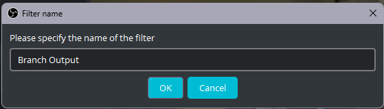

import {
  Aside,
  Tabs,
  TabItem,
  Card,
  Steps,
} from "@astrojs/starlight/components";

This is the most important part of the setup, please make sure you are familiar with [OBS terminology](/software/obs/) before continuing this section.

First let's start by making sure we have all the inputs working in OBS

<Steps>

1. Open OBS

2. Make sure you are in a [**Recording Profile**](/software/obs/#setup-a-recording-profile)

3. Create a new **Scene Collection**

4. [Add your video sources](/software/obs/#camera-source) <Aside>Make sure you are able to see all inputs in the preview and that they are oriented correctly</Aside><Aside type="caution">If you are not seeing anything on the preview, please double check that cameras are on and plugged into the computer</Aside>

5. [Add your audio sources](/software/obs/#audio-source)

</Steps>

### Configuration of OBS Plugin

Here we will setup the recording settings so that all the sources can produce a recording separately.

<Steps>

1. Click on the top tab named **Docks**
   

2. A window will popup

3. On the **drop down box** in the **lower right side** of the window were it says **Interlock** make sure that the option **Streaming or Recording** is selected.<Aside type="danger">If you don't do this step first all your sources will start a recording automatically without clicking the **Start Recording** button and it wont stop until you close OBS.</Aside>
   

</Steps>

### Source Configuration

Now we need to add a **filter** to each source. We need to do this to tell the plugin what sources should create a separate video file.

<Steps>

1. Right click on the source you want to record separately

2. Click on the **filter** option

3. On the **Effect Filters bucket** on the left click the lower **+** button and select Branch Output
   

4. Name the filter and click **OK** button
   

5. Check the checkbox named **stream recording** and click **Apply**
   

6. The filter has now been applied

7. Click on **Close**

</Steps>
