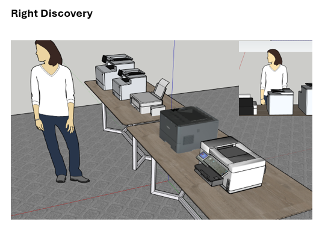

import { Aside, Steps, LinkCard } from "@astrojs/starlight/components";

The position of the cameras it's important but there's some key points to have in mind.

## Mapping Cameras

In order to capture all the data needed it's imperative that you position the cameras were there's little overlapping with each other.

### Camera Position

<Aside>
  This will depend on the space you have available to you. Sometimes you may
  need to get creative with positioning if there's a limited amount of space.
</Aside>

Think about what you want to capture like.

As an example, imagine you want to capture **reactions and interactions.** You will need a number of angels for this:

- Front Face Shot
- Left Interaction Shot
- Right Interaction Shot
- Top Interaction Shot

Once you have this list you can discard what ever you don't need for your specific situation.

<Aside type="tip">

Don't be afraid to use other software to visualize your space. By knowing positions in advance you can reduce your setup time.

</Aside>

### Camera Orientation, Mounting and Installation

Let's go over how to mount the cameras starting with the webcams.

<Aside>

There should be two types of tripods:

- Standard Tripod (Black)
- Overhang Tripod (Orange)

</Aside>

#### Webcam

We are using a Logitech Brio, this 4K camera has a tripod thread insert on the bottom.

Follow the next steps:

<Steps>

1. Screw the Logitech to a **standard tripod**

2. position it where you can
   see a **wide view** of the testing site

3. Use a **USB Type C to USB A cable**
   to connect the webcam to the recording laptop

4. Open **LogiTune** and make
   sure the camera is available.

</Steps>

#### PTZ Camera

These cameras have a wider view if they are mounted in a high point and upside down.

Follow these next steps:

<Steps>

1. Adjust the **overhang tripod** so that it looks like this
   

2. Mount the PTZ camera using the tripod threads

3. Adjust the height of the camera so that it has a high view of the room

4. Connect the power supply

5. Using a **Micro USB to USB Type A** cable, connect the PTZ Camera to the laptop

6. Using **PTZOptics Camera Control** make sure you are able to move the camera around

</Steps>
