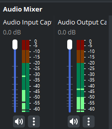

import {
  Aside,
  Tabs,
  TabItem,
  Card,
  Steps,
  LinkCard,
} from "@astrojs/starlight/components";

OBS is a free to use opensource software that you'll use to record audio and video.

## Functions

OBS can be used for lot's of things and therefore there's a broad selection of inputs and outputs but we are only goin to go over the one's we'll use.

<LinkCard
  href="#environment-setup"
  title="Environment Setup"
  description="Setup your OBS environment for recording"
/>
<LinkCard
  href="#scenes"
  title="Scenes"
  description="Learn what is an OBS scene and its usage"
/>
<LinkCard
  href="#sources"
  title="Sources"
  description="Guide on what a source is and how to add them"
/>
<LinkCard
  href="#broadcasting-and-recording"
  title="Broadcasting and Recording"
  description="Learn how to record and share video and audio in zoom"
/>

## Environment setup

The first time you open OBS you'll maybe see a profile already loaded with scenes and sources. If you want with a fresh profile and scene collection follow this steps.

### Setup a Recording profile

A **Profile** are preset settings that will change the way OBS works.

For our case, we want it to be setup for recording by doing the following

<Steps>

1. Click on the **Profile** tab
   

2. Select **New**

3. Give your profile a name and click the **OK** button

4. Select the option **Optimize for recording, I will not be streaming**
   

5. Click the **Next** button

6. Choose your desired resolution and FPS
   

7. Click the **Next** button

8. Double check you settings, if everything looks good select **_Apply Settings_**

 </Steps>

<Aside type="caution">
  It may not seem like anything happen, but now your OBS is setup for recording.
</Aside>

### New Scene Collection

A **Scene Collection** is all the scenes, video inputs, audio inputs, etc.

If you already have one that works for you use it.

If you want to start with a clean slate do the following

<Steps>

1. Click the **Scene Collection** tab

2. Select the **New** option
   

3. Give your Scene Collection a name

4. Click the **OK** button

</Steps>

Now you'll see a clean OBS Scene Collection without any inputs and a default **_Scene_** in the Scenes section in the bottom left side of the window.

<Aside type="danger" title="Important">
  Changing Scene Collection **does not automatically change your Profile,**
  these are treated separately and are not interchangeable.
</Aside>

## Scenes

Think of scenes as like a canvas where you can drop all of you inputs like video, audio, overlays, etc.

A scene contains a **collection of sources.**

This includes their position in the screen, size, audio inputs, muted inputs, etc.

<Aside type="tip">
  Treat Scenes as different camera angles, switching between scenes is easier
  than hiding and showing different cameras
</Aside>

## Sources

A **source is an input** like a screen capture, camera, HTML overlay, microphone, etc.

We are goin to cover only two sources

<LinkCard
  href="#camera-source"
  title="Camera Source"
  description="How to add a Video Capture Device source"
/>
<LinkCard
  href="#audio-source"
  title="Audio Source"
  description="How to add an Audio Input Capture source"
/>

### Camera Source

When you want to add a camera you need to select the **_Video Capture Device_** in the source section.

Here's how to add a camera source in OBS

<Steps>

1. Locate the Source section in the bottom left side of OBS window

2. Click on the **+** button in the bottom left
   

3. Select **Video Capture Device**

4. Give your source a name and click the **OK** button
   

5. You'll see a new window pop-up with lots of options
   

6. In the **Device** section, choose the camera you want to add

   <Aside>
     If you don't see the camera, make sure it's powered on and plugged into
     your computer. Then restart OBS and try again.
   </Aside>

7. In the **Resolution/FPS Type** section, choose **Custom**

8. In the **Resolution** section, choose the resolution of the camera you are adding

9. Click the **OK** button

10. You will now see your new camera source in the source section and the preview window

</Steps>

### Audio Source

When you want to add a microphone input you need to select the **_Audio Input Capture_** in the source section.

Here's how to add a microphone input in OBS

<Steps>

1. Locate the Source section in the bottom left side of OBS window

2. Click on the **+** button in the bottom left
   

3. Select **Audio Input Capture**

4. Give your source a name and click the **OK** button

5. In the **Device** section choose the audio interface or microphone you want to add

6. Click the **OK** button

7. you will now see your new audio source in the Audio Mixer and Source sections

</Steps>

There are additional steps you need to make since your audio interface might be in stereo mode.

  

You can in the screenshot that the left audio input has only one green bar (left) and the right one both.

Here's how to get both

<Steps>

1.  In the **Audio Mixer** section, right click the audio input you want to fix

2.  Click **Advanced Audio Properties**

3.  Locate your audio input and check the box in the **Mono** column
    

4.  Click on the **Close** button

5.  Now both channel will be filled
    

</Steps>

<Aside type="caution">
  Sometimes audio inputs disappear, if this happens, add them again or restart
  OBS
</Aside>

## Broadcasting and Recording

We will focus in the Control section that you can fin in the bottom right of the OBS window.

  

We only need to focus in two buttons

- Strat Recording
- Start Virtual Camera

### Start Recording Button

This button will start a recording of all the sources in the selected scene.

<Aside type="caution">
  You can switch scenes while recording, just make sure the audio sources match
  between scenes. If you have a scene with microphone input and then switch to
  another scene without that microphone, you will loose sound in the recording.
</Aside>

After clicking this button, the button's text will changer to **Stop Recording** and a pause button will appear in the right.

  

These are self describing, but here's the actions of these buttons just in case.

<Card title="Stop and Pause">
  <Tabs>
    <TabItem label="Stop Recording Button">
      This will pause the recording and will finish the video encoding.
    </TabItem>
    <TabItem label="Pause Button">
      This will pause the recording until you press the pause button again.
    </TabItem>
  </Tabs>
</Card>

By default your recording are going into the **Videos** folder in your computer.

<Aside type="caution">
  If this is not the case click **File > Settings > Output** and you'll see
  under **Recording > Recording Path** the path were OBS is recording
</Aside>

### Video Format

There's different outputs the video encoder will let you choose from. By default the format of the video will be **mkv.**

Here's some benefits of using **mkv** vs **mp4**

|                  | MKV                                                                 | MP4                                                  |
| ---------------- | ------------------------------------------------------------------- | ---------------------------------------------------- |
| File size        | Larger files due to lossless compression                            | Smaller files due to efficient compression           |
| Compatibility    | Supports many codecs, but some devices may not support MKV natively | More widely compatible with most devices             |
| Video quality    | Higher quality due to lossless compression                          | Lower quality than MKV due to compression            |
| Features         | Supports multiple audio and subtitle tracks, chapters, and tags     | Supports fewer tracks and basic metadata             |
| Error resilience | Can recover from file corruption and play partial content           | Often makes the entire video unplayable if corrupted |

The most important feature is the **Error resilience.** If for some reason OBS or the computer crashes, the video format will be playable and readable up to the point where the app crashed.

<Aside type="danger">
  Although slim, there's still chance for the video to corrupt if any service
  stops. MKV it's just better for catastrophic events compared to mp4
</Aside>

<Aside type="tip" label="Sharing Formats">

MKV format videos are **large**. In order to **reduce the size** you can
convert them into an **mp4 file.** You can use OBS for this by going to:

> **File > Remux Recordings > Button in the OBS Recording Section > Choose Recording > Remux.**

</Aside>

### Start Virtual Camera Button

This button will allow you to share your current OBS scene by creating a **Virtual Camera** that you can choose in Zoom, Teams, etc.

  

After clicking this button, the button's text will change to **Stop Virtual Camera.** Press this button to stop sharing your OBS feed.

  

<Aside type="caution">
  This will only share video and not audio. To share audio in Zoom or any other
  meeting app please select the audio interface as the microphone input.
</Aside>

## OBS Plugins

Plugins are a great way to enhance the functionality of OBS. You can find a bunch of them made by the community here:

<LinkCard
  title="OBS Plugins Site"
  href="https://obsproject.com/forum/plugins/"
/>

### Multiple Source and Scene Recording

By default OBS cannot record or stream separate sources and scenes at the same time. We can add this functionality by using a plugin called **Branch Output**

<Card title="Branch Output PLugin">
  <LinkCard
    title="OBS site"
    href="https://obsproject.com/forum/resources/branch-output-streaming-recording-filter-for-source-scene.1987/"
    description="Streaming/Recording filter for source/scene 1.0.2"
  />
  <LinkCard
    title="GitHub Repo"
    href="https://github.com/OPENSPHERE-Inc/branch-output"
    description="Branch Output Repository"
  />
</Card>

This plugin allows you to can record each source individually. As a result, depending on the number of sources you wnat to record, this plugin will produced a video file per source.

<Aside>

As an example, if you have 2 camera sources you want to record, you will see 3
files:

- Scene Recording
- Source 1 Recording
- Source 2 Recording

</Aside>
