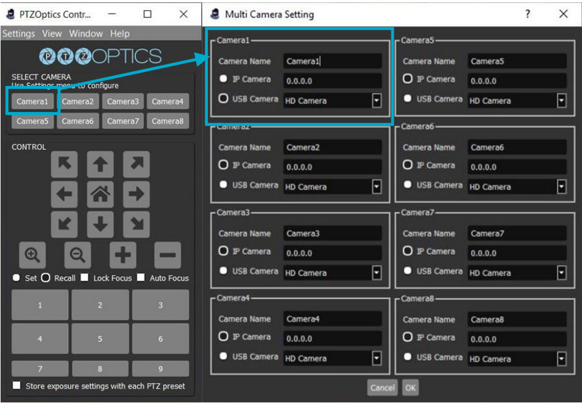
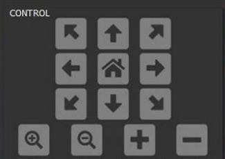

import {
  Aside,
  Tabs,
  TabItem,
  Card,
  Steps,
} from "@astrojs/starlight/components";

This application will help you **move and reposition** the PTZ cameras.

  

### Camera Configuration

You need to configure the cameras in the software in order to control them.

<Aside type="tip">
  You can have **multiple instances of PTZOptics Camera Control open.** It would
  be recommended to **have one instance open for each camera.**
</Aside>

Here you can configure multiple cameras and their type of communication (IP or USB)

Lets go over how to **configure a PTZ camera.**

<Aside>Make sure your camera is plugged in.</Aside>

<Steps>

1. From the **Settings Tab,** select **Multi Camera Setting.**

2. In the **Camera1** box, make sure your PTZ camera is showing and select **USB Camera**

3. Click the **OK** button

4. In the home screen, Click **Camera1**

   <Aside>
     This is not automatically clicked, make sure its selected before trying to
     reposition the PTZ camera.
   </Aside>

5. Try moving the PTZ camera using the **arrows**

</Steps>

### Main Home Screen Controls

  

The arrows allow you to **pan and tilt.**

<Card title="Arrow Controls">
  <Tabs>
    <TabItem label="Up Arrow" icon="up-arrow">
      Tilt the camera upwards.
      <Aside>
        We usually have the PTZ cameras upside down, so the tilt directions will
        be flipped around.
      </Aside>
    </TabItem>
    <TabItem label="Down Arrow" icon="down-arrow">
      Tilt the camera downwards.
      <Aside>
        We usually have the PTZ cameras upside down, so the tilt directions will
        be flipped around.
      </Aside>
    </TabItem>
    <TabItem label="Left Arrow" icon="left-arrow">
      Pan the camera to the left.
      <Aside>
        We usually have the PTZ cameras upside down, so the pan directions will
        be flipped around.
      </Aside>
    </TabItem>
    <TabItem label="Right Arrow" icon="right-arrow">
      Pan the camera to the right.
      <Aside>
        We usually have the PTZ cameras upside down, so the tilt directions will
        be flipped around.
      </Aside>
    </TabItem>
  </Tabs>
</Card>

If you want to **Zoom in or out** use the following

<Card title="Zoom Controls">
  <Tabs>
    <TabItem label="Magnifying Glass +" icon="magnifier">
      Zoom or punch **in**
    </TabItem>
    <TabItem label="Magnifying Glass  -" icon="magnifier">
      Zoom or punch **out**
    </TabItem>
  </Tabs>
</Card>

<Aside type="caution">
  The **+** and **-** buttons are for **exposure** but our cameras do not have
  that feature
</Aside>
